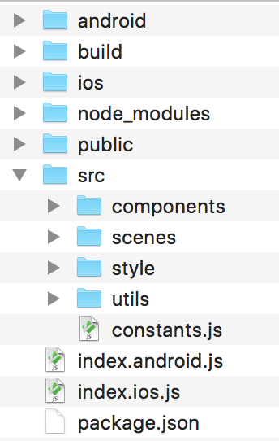
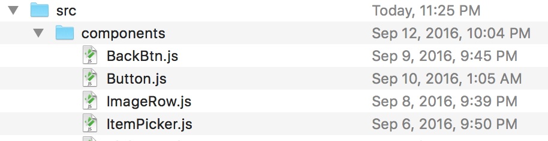
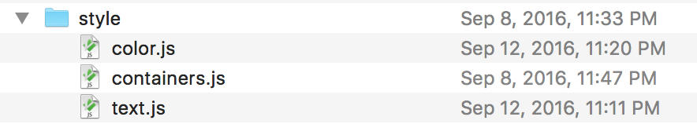
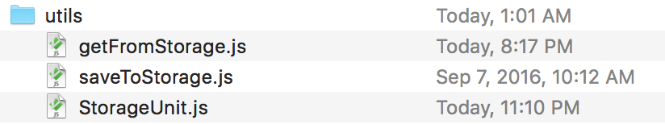

Currently, I am building a small notebook app with React-native. While the framework has so much fun to play with, and make my life much better and easier to build cross-platform projects, it does give me some pain, especially when the project grows bigger and bigger.

My project folder got messy when I started creating new scenes, and global styles. At the very beginning of the development, I kept all style files inside of its React Component class definition file, declaring all styles (font size, color, background color, container flexbox, etc.).

But as soon as the scenes and components of the app gets more and more complicated (and some of the components were very similar, only have slightly differences, like font size, functions), I realized that I wrote too much duplicated code, copying and pasting them all over the project!

OK, it’s time to take some effort to clean up the folder , and refactor the code. Keep it DRY.

## Overview
Here is the structure I’m using for my React-native project:




```
/android: Android native code
/build: stores iOS apk and Android app installation packages
/ios: iOS native code
/public: stores images, audios and other assets
/src: JavaScript source files
  constants.js: I put all constant variables into this file
  /components: React-native components, such buttons, lists
  /scenes
  /style: shared style files, text, colors, etc.
  /utils: reusable functions
index.android.js: Android entry file
index.ios.js: iOS entry file
```

## Here are 3 steps that I followed to re-organize the folder:

### 1. Move all components into a separate folder




### 2. Put style code into a separate file



My app uses 4 different styles of text, title, subtitle, paragraphs, data. It would be much more easier to just import the style of text, and use it directly.

I put shared text styles in to `text.js` file:

```typescript
const text = StyleSheet.create({
    p: {
      color: 'black',
      fontFamily: 'Open Sans',
      fontSize: 14,
    },
    title: {
      fontWeight: 'bold',
      color: 'black',
      fontFamily: 'Open Sans',
      fontSize: 20,
    },    
    subTitle: {
      fontWeight: 'bold',
      color: 'black',
      fontFamily: 'Open Sans',
      fontSize: 14,
    },
    data: {
      color: 'black',
      fontFamily: 'Open Sans',
      fontSize: 25,
    },
  });
export default text;
```

When defining React component, you can simply import this text style, and use it directly.

```tsx
<Text style={text.p}>settings</Text>
```

Overriding the style is very easy, just like the way we do with CSS inline styles :)

```tsx
<Text style={[text.p, {backgroundColor: 'red']}>settings</Text>
```

The idea of separating style code by fundamental components is inspired by Atomic Design. It believes small atoms build up big elements.

I think the idea is very similar to the concept of React-Native, focusing on building components. So I tried it out in this way, so far so good!

### 3. Move shared functions into a separate folder



This idea is came from Airbnb’s open source library, react-dates. Originally, I was checking its source code, and get some ideas on my editor linting config. But soon I realized that the way Airbnb organizes source files was amazing and elegant.

This makes my code easy to maintain, but also much more easier to access in different components. If the code is much more easy to maintain than before, I am sure the development process would be more smooth, and so as my productivity.

## Ending
This folder structure saves me so many efforts on modifying shared styles! Before organizing the folder into this way, I need to go to each component, find out the specific line for a specific style definition. But now, all I need to do is going straight to the style file, open it, and change it. That’s it!

Now, developing in React-native truly becomes one of the best tasks in my spare time, and I am more productive and organized.

Hope this article can give you some ideas and inspirations on gathering your project files.

Happy coding! 🎉
