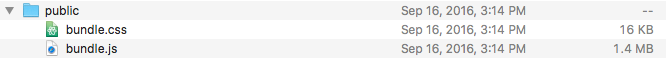

*Originally posted on Medium*

When using React.js in my personal projects, I found out that when the project grows bigger and bigger, the final build file gets bigger and bigger as well.

The build JavaScript file easily goes above 1MB, even though I only have less than 10 React components.



With this huge file size, the page spends 4 seconds to download JavaScript and CSS files, and total 7 seconds for initial page rendering.
This is definitely not good.

Not good for page performance, neither for user experience.

So, how can I minimize the file size?

I spent some time looking around all possible solutions, and here are some efficient tricks that can solve the problem.

## Tricks
### minify front end code
This is the most commonly used method when we want to minimize front end file size. If using Webpack as React.js build tool, we can use webpack.optimize.UglifyJsPlugin to minify front-end needed files.

### create production env variable in Webpack config
```typescript
new webpack.DefinePlugin({
  'process.env': {
    'NODE_ENV': JSON.stringify('production')
  }
})
```

### tree shake
According to current stable version (1.13.2), Webpack does not support ES6 tree shaking. But there is one little trick we can use:
When setting up babel config, use the following preset:

```json
"babel": {
  "presets": [
    "react",
    [
      "es2015",
      {
       "modules": false
      }
    ]
  ]
}
```

With Webpack 1.13.2, tree-shaking works like magic.

## Before vs. After
Use my personal project as an example. I have 10 React components (most of them are having long definitions and more than 5 functions). CSS is not included in the final bundle.js build file.

Here is result:

original file size(with no optimization): 1.35MB
with tree-shaking: 576kB (-58.3%)
with tree-shaking + Production env variable: 544 kB (-60.6%)
plus minify: ~10% of previous step’s file size (544 kB)
If using these 3 tricks together, the final size of bundle.js would be ~500kB, only 36.2% of its original size.

These 3 tricks are definitely powerful, and easy to use!

## Future: Webpack 2.0
I am excited to see Webpack 2 support ES6 tree shaking, and simpler way setting up Node.js production flag in Webpack config.

Currently Webpack is beta-testing v2.1 version. I am trying out different new features. It’s awesome to see Webpack is getting better and better!

## What’s your trick?
I would like to know what’s your trick when optimizing React.js performance. Leave a comment and let’s discuss!

