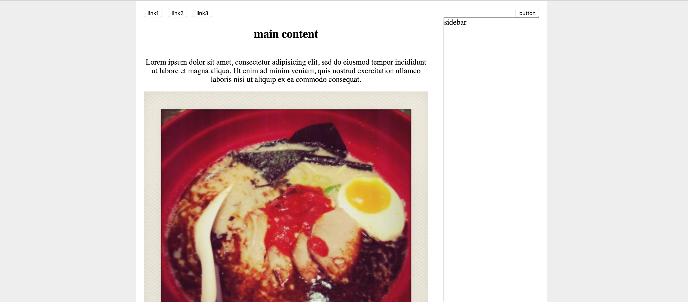
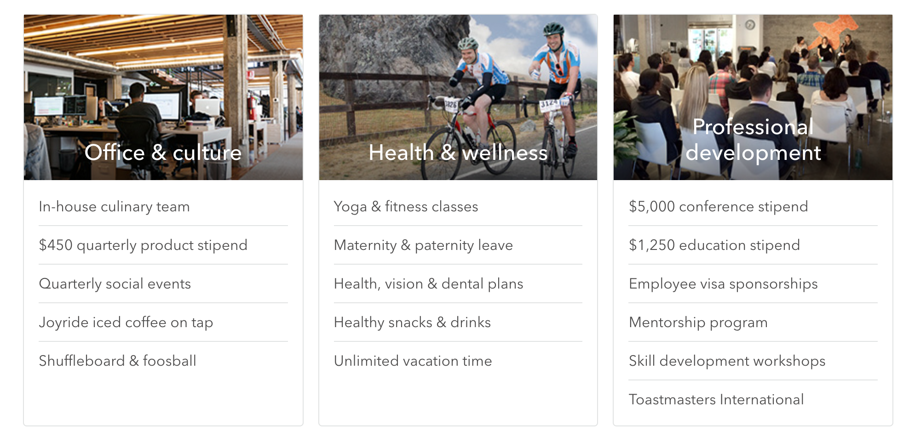
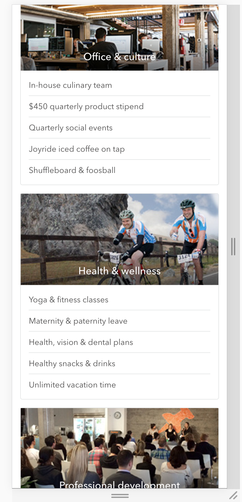

最近面试了几家公司的front end职位。在这几次面试中，几乎每次面试的css题目中都有涉及到flexbox的layout。可以看出，flexbox在工业界的使用还是很广泛的。（我几乎没有被问到关于float的问题）

这篇文章会总结flexbox的常用技巧，以及适用场景。未来会添加grid system的信息和内容。

本文的实例参考自[css grid vs flexbox](https://tutorialzine.com/2017/03/css-grid-vs-flexbox)

## 两个例子
### 用于整个页面的layout
假设我们有如下的page design:



我们可以看到，page上有navbar，main content（分左右两栏），以及footer（未包含在截图中）。这样的layout下可以使用flexbox吗？

当然可以！通过以下几个步骤，即可实现一个简单的layout：

```
1. 把这几个component放入一个`div`中，
   即flexbox的container部分，将其设置为`display: flex`。
2. 设置`flex-direction: column`。
   这个property可以将flexbox的component放置的位置设置为列。
3. 设置`justify-content: space-between`。
   这个property的值会告诉浏览器如何计算flexbox中element的间隔和位置。
```

### 用于某一个小的component的layout
在上例，我们应用flexbox实现一个页面的整体layout。

如果我们想做card container的layout，且使其支持responsive design，（design如下图，直接用了Thumbtack网站上的card design截图）

#### design - big screen



#### design - small screen



以上layout也可以使用flexbox，且非常简便。

具体的实现如下：

```html
<div class="perks">
  <div class="perks--body">
    <div class="perks--groups">
      <div class="perks--group">
        <div class="perks--image" style="background-image: url(https://static6.thumbtackstatic.com/_assets/images/release/pages/jobs/submodules/perks/images/office-22209281.jpg);">
          <h2>Office &amp; culture</h2>
        </div>
        <div class="perks--list">
          <div class="perks--item">In-house culinary team</div>
          <div class="perks--item">$450 quarterly product stipend</div>
          <div class="perks--item">Rooftop deck with 360&deg; view</div>
          <div class="perks--item">Quarterly social events</div>
          <div class="perks--item">Joyride iced coffee on tap</div>
          <div class="perks--item">Shuffleboard &amp; foosball</div>
        </div>
      </div>
      <div class="perks--group">
        <div class="perks--image" style="background-image: url(https://static7.thumbtackstatic.com/_assets/images/release/pages/jobs/submodules/perks/images/wellness-7fda7cd8.jpg);">
          <h2>Health &amp; wellness</h2>
        </div>
        <div class="perks--list">
          <div class="perks--item">Yoga &amp; fitness classes</div>
          <div class="perks--item">Maternity &amp; paternity leave</div>
          <div class="perks--item">Health, vision &amp; dental plans</div>
          <div class="perks--item">Healthy snacks &amp; drinks</div>
          <div class="perks--item">Unlimited vacation time</div>
        </div>
      </div>
      <div class="perks--group">
        <div class="perks--image" style="background-image: url(https://static6.thumbtackstatic.com/_assets/images/release/pages/jobs/submodules/perks/images/presentation-ede318f4.jpg);">
          <h2>Professional development</h2>
        </div>
        <div class="perks--list">
          <div class="perks--item">$5,000 conference stipend</div>
          <div class="perks--item">$1,250 education stipend</div>
          <div class="perks--item">Employee visa sponsorship</div>
          <div class="perks--item">Mentorship program</div>
          <div class="perks--item">Skill development workshops</div>
          <div class="perks--item">Toastsmasters International</div>
        </div>
      </div>
    </div>
  </div>
</div>
```
---

```css
// media query breakpoint
$mobile: "(max-width: 900px)";
$container-width: 900px;
$card-margin-right: 10px;
$card-margin-bottom: 8px;
$color-gray-light: rgb(232,234,234);
$color-gray-medium: rgb(121,120,120);
$color-white: rgb(255,255,255);
.perks {
  max-width: $container-width;
  font-family: sans-serif;
  .perks--groups {
    display: flex;
    flex-wrap: wrap; // support responsive
    .perks--group {
      box-sizing: border-box;
      flex: 1; //设置每个.perks--group的宽度相等
      display: flex;
      flex-direction: column;
      border: 1px solid $color-gray-light;
      border-top-left-radius: 4px;
      border-top-right-radius: 4px;
      &:not(:last-child) {
        margin-right: $card-margin-right;
      }
      .perks--image {
        display: block;
        height: 180px;
        position: relative;
        background-size: cover;
        background-repeat: no-repeat;
        h2 {
          text-align: center;
          position: absolute;
          bottom: 0;
          width: 100%;
          color: $color-white;
          font-weight: 400;
        }
      }
      .perks--list {
        padding: 12px 20px;
        .perks--item {
          padding: 12px 0;
          color: $color-gray-medium;
          &:not(:last-child) {
            border-bottom: 1px solid $color-gray-light;
          }
        }
      }
    }
  }
}
@media #{$mobile} {
  .perks {
    .perks--groups {
      .perks--group {
        width: 100%;
        &:not(:last-child) {
          margin-bottom: $card-margin-bottom;
        }
        &:not(:last-child) {
          margin-right: 0;
        }
      }
    }
  }
}
```

在使用flexbox时有几个小技巧：

- 当需要设置一个box内的flex component的宽度比时，灵活使用`flex`。`flex`是`flex-grow`, `flex-shrink`和`flex-basis`的简略写法。
- `align-items`可以纵向对其
- `flex-wrap`可以强制所有element在一行，或是分成几行。同media-query一起灵活使用，可以实现responsive design

Codepen实例如下：

<p class="codepen" data-height="300" data-pen-title="Untitled" data-default-tab="html,result" data-slug-hash="ybjXZQ" data-user="chenzhe142" style="height: 300px; box-sizing: border-box; display: flex; align-items: center; justify-content: center; border: 2px solid; margin: 1em 0; padding: 1em;">
  <span>See the Pen <a href="https://codepen.io/chenzhe142/pen/ybjXZQ">
  Untitled</a> by Zhe Chen (<a href="https://codepen.io/chenzhe142">@chenzhe142</a>)
  on <a href="https://codepen.io">CodePen</a>.</span>
</p>
<script async src="https://public.codepenassets.com/embed/index.js"></script>


## 小结

flexbox非常简单易用，且可以实现非常棒的layout效果，对比float，减少了大量的css的使用，也使代码更易维护。唯一的缺点可以说是实现responsive design，运用media-query时还比较繁琐，需要一点一点地精确调整margin，padding或者其他property的值。

综上所述，flexbox非常强大，值得我们深入学习和应用。

## 参考链接
- [css-tricks - a guide to flexbox](https://css-tricks.com/snippets/css/a-guide-to-flexbox/)
- [css grid vs flexbox](http://tutorialzine.com/2017/03/css-grid-vs-flexbox/)

