近期在整理自己的portfolio，在GitHub上看自己GitHub Pages上的博文停留在2017年5月，页面设计看起来也有了些时代感。

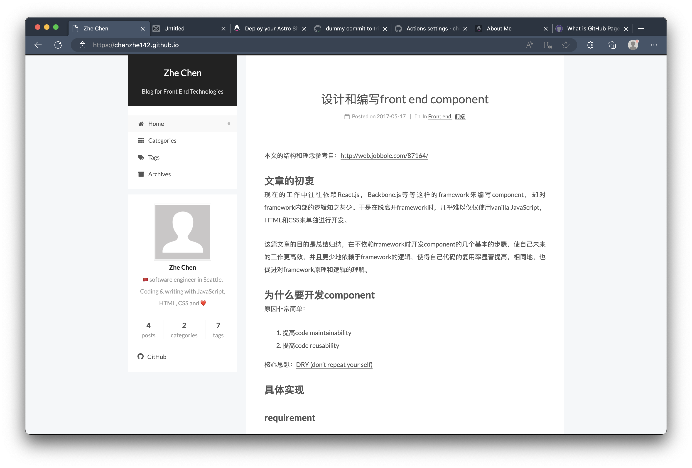

最近在入门做ML和新用户冷启动，我想整理和记录一下自己的学习心得，于是花了一晚上时间把GitHub Pages重新翻新了一下。

## 为什么选择Astro

时间有点久远，我已经记不太清当时的GitHub Pages的模板是怎么配置的了，单看UI比较像Jekyll。
九年时间内，前端的发展变化实在是太大了。我想看看现在人们都用什么框架来搭建GitHub Pages。

我用AI做了一个细致的搜索，我也去Reddit和各大网站上手动搜索了一圈。总体来说，推荐[Astro](https://astro.build/)的人很多。

我实际试用了一下，网页交互效果确实非常好，可以复用的模板很多，而且可以做成纯静态的网站部署在GitHub Pages上（省下一笔服务器托管费用）。

## 项目配置

首先跟着[官方文档](https://docs.astro.build/en/install-and-setup/)先来初始化项目。

```shell
npm create astro@latest -- --template blog
```

Astro的CLI界面交互做得有点可爱，引导也做的很棒。吉祥物也有一点像Claude。

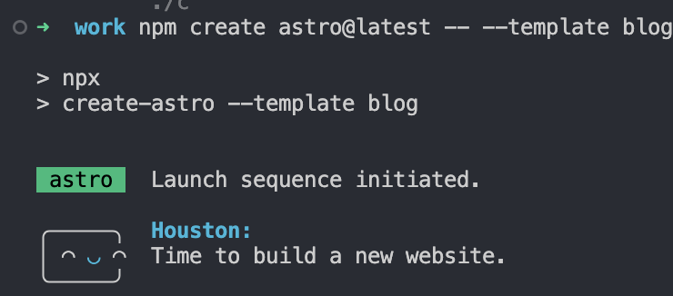

我现有的GitHub Pages repo比较简单，于是就直接在内部初始化了。`legacy/`是基于Jekyll生成的老代码。

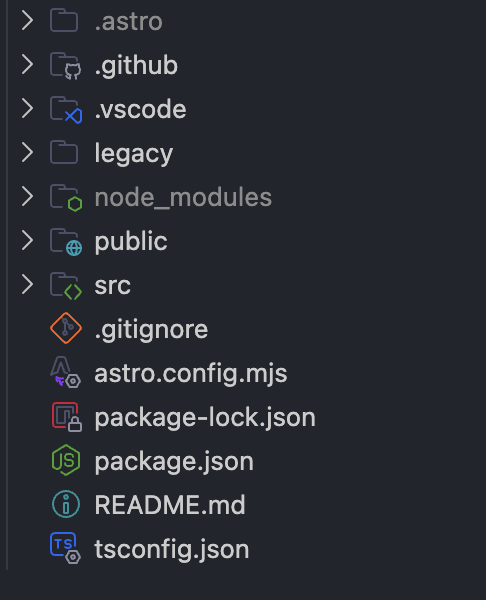

初始配置命令默认生成的是TypeScript，可读性很强。项目配置简洁易懂。

我安装了VS Code的[Astro扩展](https://marketplace.visualstudio.com/items?itemName=astro-build.astro-vscode)，配套的syntax highlight、hinting和auto-completion很全面。对于简单配置Astro的项目来说可能有点overkill了，不过对于想更好customize和深度修改界面的人来说，就非常有必要和帮助了。

实际修改Astro的UI和routing，我感觉和React项目很相似。很容易上手。

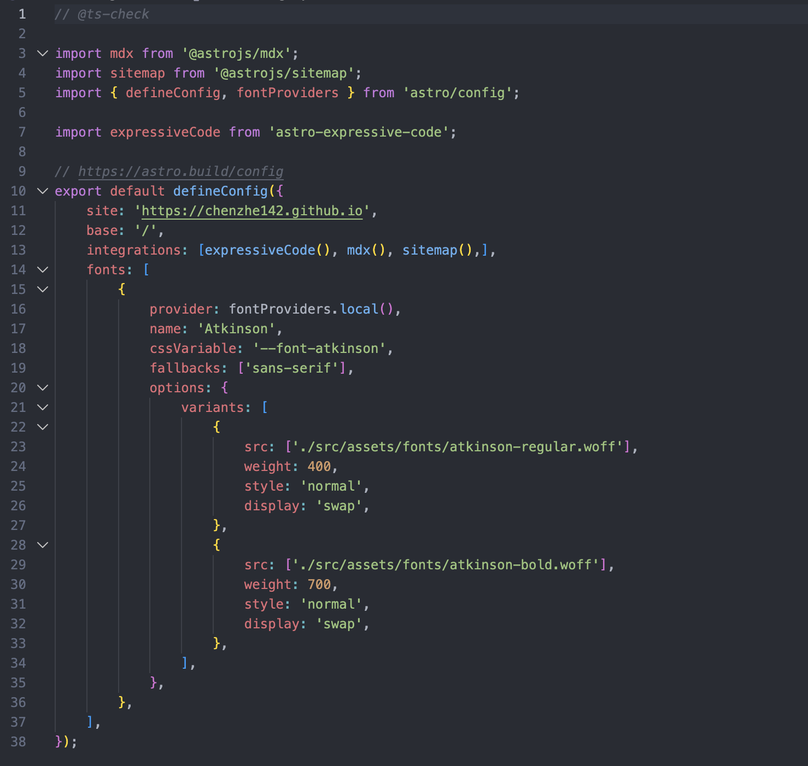

## 拥抱vibe coding的日常

在本地的浏览器launch了Astro生成的项目之后，我感觉整体的字号有点大。比起手动调节字号，让Gemini直接修改CSS更加快捷。经过几轮对话，字体、页边距调整到了舒服的程度。

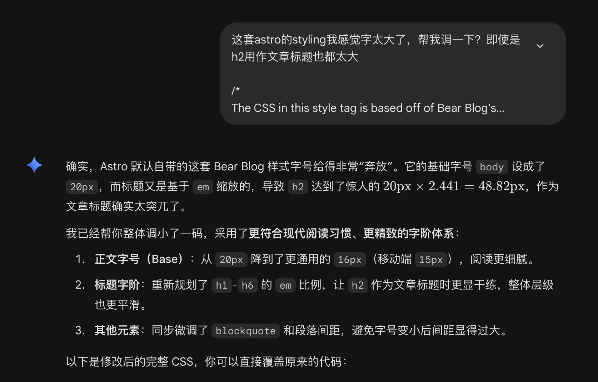

我非常喜欢[少数派](https://sspai.com)的网站设计语言：


参照少数派的博文布局，在调整完整体样式之后，我想对项目进行进一步的微调，并增加一些新功能：

- 调整文章页的布局
- 调整文章发布时间的位置
- 增加tag组件，用来分类博文
- 增加sticky table of content组件
- 增加`/tags/[tag]` route

以下是微调具体的实现。

### 界面调整

**1. 调整文章页的布局**


Astro默认的文章页布局附带头图、时间在文章标题上部，且文章本体的宽度比较窄。同现有的Jekyll文章页布局比起来，可读性稍微差一些。


我给Gemini提出了以下几个要求：

- 文章内容居中，增加可读性
- 调整头图大小，make it optional
- 增加文章内容的width

Gemini基于我的指令，给出了以下的CSS修改。同时也改进了响应式。

```css
.article-layout {
  display: grid;
  grid-template-columns: minmax(0, 200px) minmax(0, 820px) minmax(0, 200px);
  gap: 4rem;
  justify-content: center;
}
.prose      { grid-column: 2; }   /* 正文固定在中间列 */
.sidebar-toc { grid-column: 3; }  /* 目录在右列 */

@media (max-width: 1300px) {
  .article-layout { grid-template-columns: minmax(0, 820px) minmax(0, 200px); }
  .prose { grid-column: 1; } .sidebar-toc { grid-column: 2; }
}
@media (max-width: 1024px) {
  .article-layout { display: block; }
  .sidebar-toc { display: none; }
  .prose { max-width: 760px; margin: 0 auto; }
}
```

修改了CSS样式后，达到了预期效果。

**2. 调整文章发布时间的位置**

这里我进行了手工调整，修改了element render的顺序，把文章发布时间移到了标题下方。

**3. 增加tag组件**

现有的Jekyll文章页有很棒的基于tag进行的文章分类，我想把相同的功能也加入到Astro项目中来。
根据我提出的需求，Gemini给出了相应的[代码实现](https://github.com/chenzhe142/chenzhe142.github.io/blob/master/src/layouts/BlogPost.astro#L265-L278)。

**4. 增加sticky table of content组件**

在我给Gemini的指令中，我提出模仿少数派的文章页面的ToC组件、基于Astro来实现这个组件。

Gemini给出的代码实现是：

- 通过当前文章从`Astro.props.headings`里筛出`h2`/`h3`渲染成一个sticky侧边栏

```astro
const tocHeadings = headings?.filter((h) => h.depth > 1 && h.depth < 4) || [];
```

```astro
<aside class="sidebar-toc">
  <h2 class="toc-title">ON THIS PAGE</h2>
  <ul class="toc-list">
    {tocHeadings.map((heading) => (
      <li class={`toc-item depth-${heading.depth}`}>
        <a href={`#${heading.slug}`}>{heading.text}</a>
      </li>
    ))}
  </ul>
</aside>
```

click to scroll通过`#anchor`来实现，外加`html { scroll-behavior: smooth }`。

之后对link的hover效果进行了微调，增加了`transition`以及调整了文字颜色，整体设计简洁。

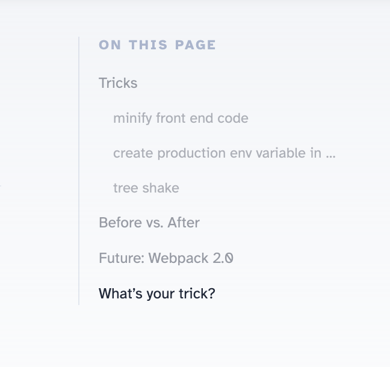

### 结构微调

**1. 增加`/tags/[tag]` route**

`/tags/[tag]`是为了支持文章基于tag分类浏览所增加的一条新的route。

类似于`Next.js`，Astro也是基于文件夹的名字来确定route的。

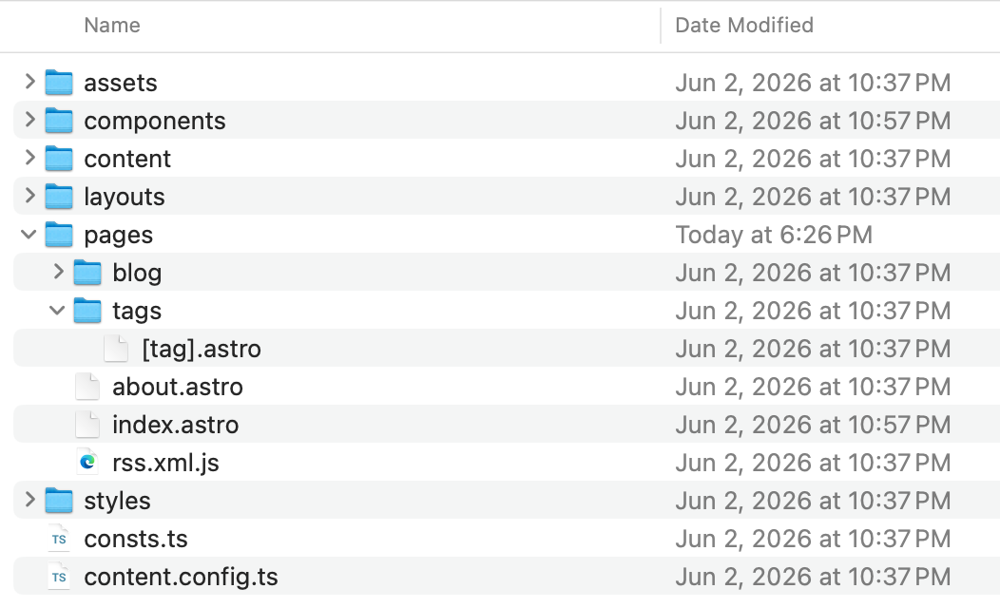

```typescript
// 1. 核心：告诉 Astro 这条动态路由需要生成哪些具体的标签页面
export async function getStaticPaths() {
    const allPosts = await getCollection("blog");

    // 提取所有文章中出现过的 tags，并去重
    const uniqueTags = [
        ...new Set(allPosts.map((post) => post.data.tags || []).flat()),
    ];

    // 为每个 tag 返回一个对象，包含 params（路由参数）和 props（传递给页面的数据）
    return uniqueTags.map((tag) => {
        const filteredPosts = allPosts
            .filter((post) => post.data.tags?.includes(tag))
            .sort(
                (a, b) => b.data.pubDate.valueOf() - a.data.pubDate.valueOf(),
            );

        return {
            params: { tag },
            props: { posts: filteredPosts },
        };
    });
}

// 2. 从 Astro.params 和 Astro.props 中拿到当前路由的标签名和对应的文章列表
const { tag } = Astro.params;
const { posts } = Astro.props;
```

### 修改后的最终效果

文章页：

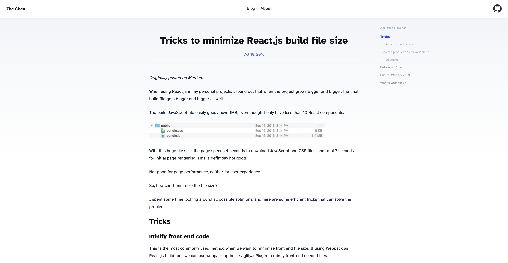

标签页：

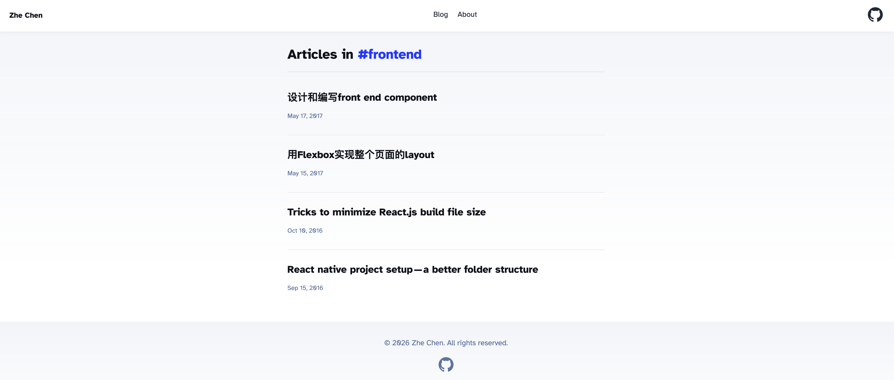

博客列表页：

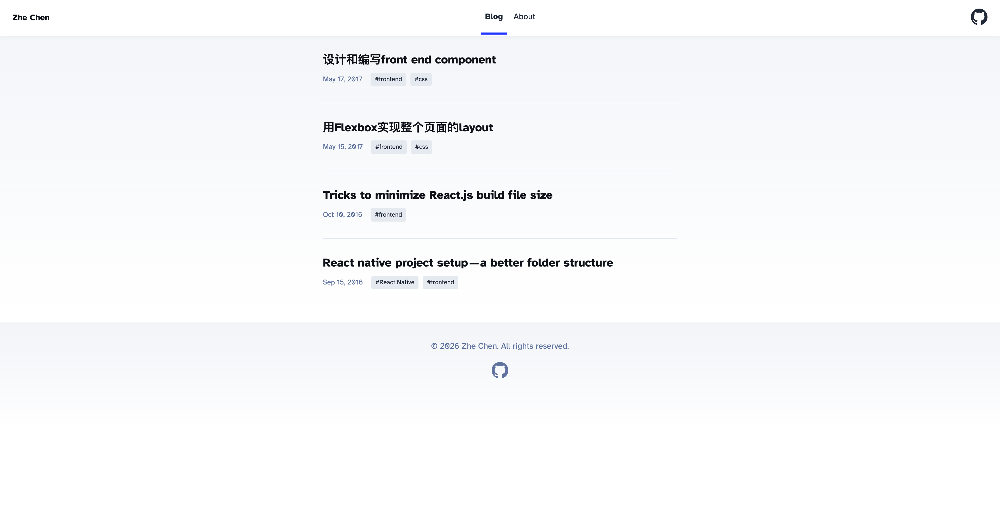

## GitHub Actions部署及权限

Jekyll过去是基于发布到`gh-pages`来进行部署的，Astro用到的是GitHub Actions。

我在这里踩了坑。Astro的blog模板本身并不带GitHub Actions的配置文件，我也不知道官方有现成的部署文档，于是就让Gemini凭印象帮我写了一版`deploy.yml`推了上去。结果workflow要么直接报错（"startup failure"），要么跑完了页面也不更新。

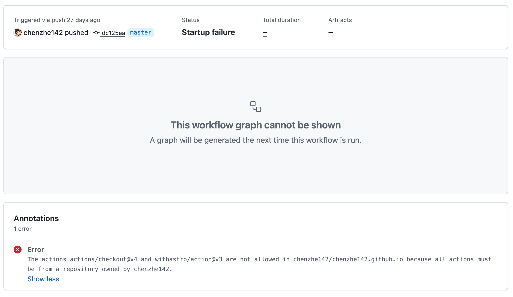

我试了好几种办法都没成，反复推commit触发重跑，折腾了一阵子。

后来才搜索到Astro官方的[Deploy your Astro Site to GitHub Pages](https://docs.astro.build/en/guides/deploy/github/)，照着它的完整配置改了一版才终于跑通。事后回看，Gemini那版只有build，缺了真正负责发布的deploy job，这可能是最初一直不生效的原因之一。

还有一点值得注意，在repo的setting里需要给出以下action可执行的权限。

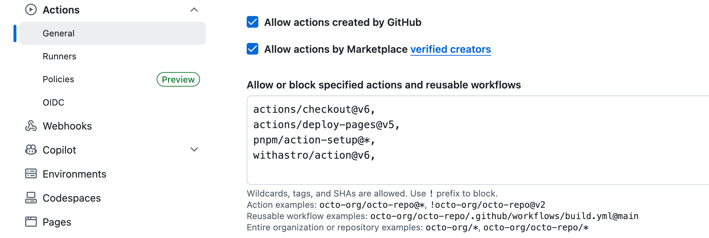

设置好之后，每当新的commit merge到`master`的时候，配置好的action就会运行。具体的状态可以在repo的action页面看到，如果workflow失败，也可以查看日志中的错误，或者进行重试。

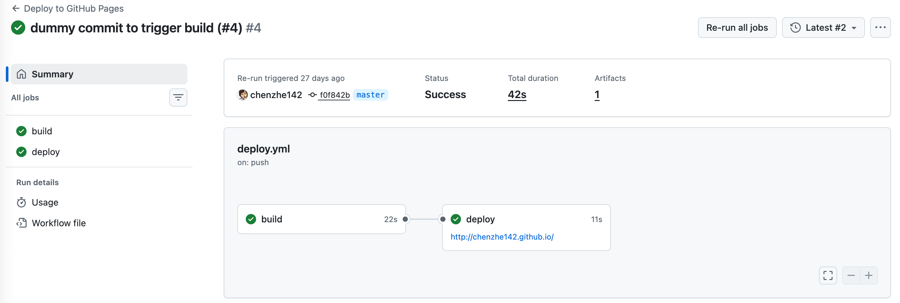

## 总结

从零开始配置Astro、并把项目部署到GitHub Pages上的过程清晰简单，代码修改非常友好，没有太大的学习曲线，而且vibe coding友好。GitHub Actions的配置有小坑可能会踩到。

我使用了网页版的Gemini进行微调页面样式，其余的配置通过手工操作，整个配置时间用了两小时左右。

这一次vibe coding的经历也让我实打实踩到了坑，Gemini在修改样式和编写组件上效果着实不错，但在实际项目部署的时候它生成的配置代码其实并不正确。项目部署的错误也更难去debug，且和GitHub Actions相关的权限问题耦合在一起，将简单问题复杂化。

今后，在实际项目中使用coding agent的时候，还是不能省去自己做调查和收集信息的步骤。AI agent很强大，但还需要使用者可以正确使用，以发挥出它的最大价值。

## 参考

- [Build your first Astro Blog](https://docs.astro.build/en/tutorial/0-introduction/)
- [Deploy your Astro Site to GitHub Pages](https://docs.astro.build/en/guides/deploy/github/)
- [GitHub Actions](https://docs.github.com/en/actions/get-started/quickstart)
